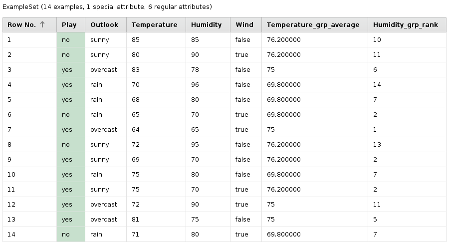

# Window functions in RapidMiner

An implementation of some window functions as a [RapidMiner](https://rapidminer.com/) process.

## About window functions

Window functions in SQL databases are aggregation functions applied to defined
"partitions" or groups of data, without actually grouping records together. The
PostgreSQL project has a good 
[tutorial](https://www.postgresql.org/docs/current/static/tutorial-window.html)
to window functions. 

This very useful functionality has been missing in RapidMiner until now.
Advanced users were of course able to implement similar solutions on their own,
but it's not trivial, so I created this project to provide a central
implementation of window functions as an easy-to-use RapidMiner process.

The [Series extension](https://marketplace.rapidminer.com/UpdateServer/faces/product_details.xhtml?productId=rmx_series)
contains some operators called Window. They are useful for time series data but
not generally applicable to arbitrary datasets. 

## About this project

The goal is to create a process that can be used in RapidMiner processes as a
"blackbox", calculating new attributes for attributes given in the process
parameters. The process is available here, it can be saved in the RapidMiner
repository and used without changing it.

The scope is to include useful functionality as far as possible in native
RapidMiner, without any extensions or programming (aside from the internal
Groovy scripting). 

### Available Functionality

All functions available in the RapidMiner 
[Aggregate](http://docs.rapidminer.com/studio/operators/blending/table/grouping/aggregate.html) 
operator are also available in the Window Functions process. (This operator is
used in the background.)

In SQL databases, partial/cumulative aggregation is possible by specifying both
PARTITION BY and ORDER BY in the window function. This gives you running sums,
for example. This is not yet implemented in the Window Functions project, but it
should be possible.

Some well-known SQL window functions are not available in RapidMiner's Aggregate
operator. The following functions have been implemented here:

- **row_number**: Unique sequential numbering of rows inside a group, ordered by
  an arbitrary attribute. Ties (equal values in the ordering attribute) still
  produce new row numbers, so this is quite useful for genereting an ID-like
  attribute for each group.

- **rank**: Numerical rank of rows inside a group, ordered by an attribute. Ties
  result in the same rank (e. g. 1, 1, 3, 4, 5). The numbering can contain gaps
  behind ties, e. g. there is no second rank in the previous example.

- **dense_rank**: Numerical rank of rows inside a group, ordered by an
  attribute. Ties result in the same rank but the numbering doesn't contain any
  gaps (e. g. 1, 1, 2, 3, 3, 4, 5). 

More functions could be implemented in the process.

### Usage examples

Calculating the average temperature for each different value of "outlook" and
adding a global rank by humidity on the Golf dataset:

The example process is available from the [**examples** directory](examples/). 

## Usage

Import the Window Functions process into your repository by downloading and
saving it in your Local Repository folder. You can also save it anywhere and use
_File/Import Process..._ to open it in Studio and save it wherever you like, for
example on a Server.

Drag the process from the repository into your process or use Execute Process
and select its location. In any case, you need to specify a few macros in the
Execute Process operator to configure it.

#### Configuration macros

**groupFields**: (required) Comma-separated list of attributes to group on. You
can put spaces after the commas. At least one grouping attribute is required. If
only one attribute is used, is has to be nominal (this is a RapidMiner
limitation). 

Sometimes it's useful to work without grouping, e. g. to calculate an overall
average or a rank by some attribute. In this case, just generate a dummy
grouping attribute with a value like "x", use it for grouping, and remove it
later. (An obvious enhancement idea for a future version: the process could do
this automatically.)

**function**: (required) Name of the function to apply. Either one of the function names
from the Aggregate operator or one of the implemented functions:

- row_number
- rank 
- dense_rank

**valueField**: (required) The name of the value attribute which the aggregation function
acts upon. 

**orderField**: For the ranking and numbering functions, the ordering attribute
inside the subgroup. If you're using the standard aggregation functions of
RapidMiner's Aggregate operator, this doesn't need to be specified.

